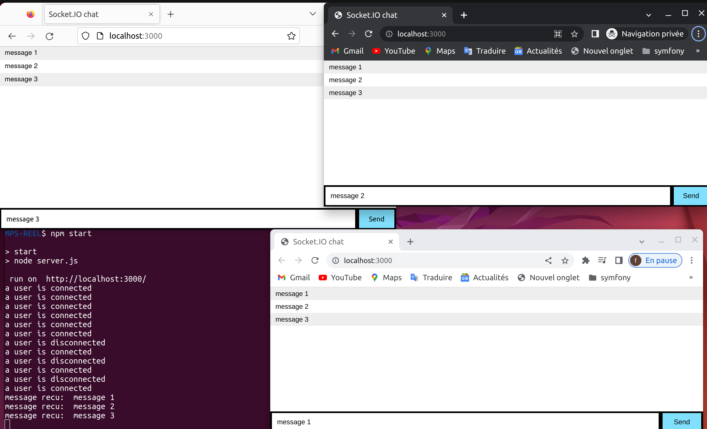

# JS WebSocket
## Auteur
| Nom     | Prénom        | Email                 |
|---------|---------------|-----------------------|
| *TEKFA* | *Fouad* | *tekfouad06@gmail.com*|

## 
Ce code est une application de chat simple construite avec Socket.IO et Express. Il permet aux utilisateurs d'envoyer et de recevoir des messages en temps réel.

## Démarrage :
- [ ] Exécutez npm install pour installer les dépendances du projet.
- [ ] Exécutez npm start pour démarrer le serveur.
- [ ] Ouvrez un navigateur Web et accédez à http://localhost:3000.

## Capture d'écran de l'application en action 

